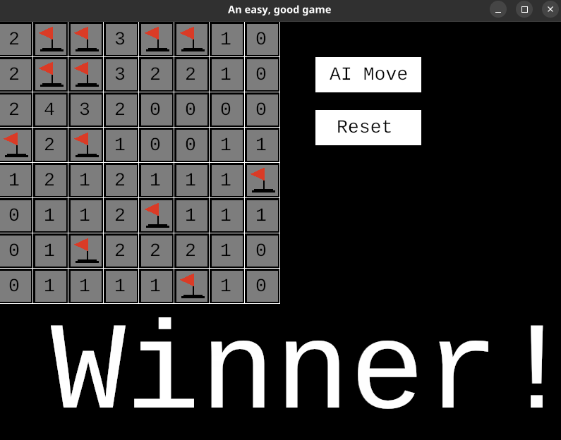

# Rust Minesweeper AI Game

This is a Minesweeper game implemented in Rust using the `ggez` game framework. The game features an AI component that can make moves using a knowledge-based system.




## Getting Started

### Prerequisites

Make sure you have the following installed on your machine:

- Rust and Cargo: Follow the instructions [here](https://www.rust-lang.org/tools/install) to install Rust.
- `ggez` crate: This game uses the `ggez` game framework.
- Be sure to add the below crates to your `Cargo.toml` file:

```toml
[dependencies]
rand = "0.8"
ggez = "0.9.3"
```
## Installation
1. Clone the repository
```bash
git clone https://github.com/ksmit323/rust-ai-minesweeper.git
cd rust-ai-minesweeper
```
2. Build the project
```bash
cargo build
```
3. Run the game
```bash
cargo run
```
## Project Structure
- main.rs: Entry point of the game.
- lib.rs: Module containing the game logic, including the Minimax algorithm.

## How to Play
- Click on any cell to make your own moves
- Click on the "AI Move" button to let the AI move for you
- Click the "Reset" button to start over

## Propositional Logic
The Minesweeper AI uses a knowledge-based approach using propositional logic to reason about the game board. The board is represented as a set of propositional variables, with each variable representing a cell on the board. The AI then uses rules of inference to deduce which cells are safe and which cells contain mines.

The AI uses several types of rules, including:

- **Single-cell rule**: If a cell is known to be a mine or a safe cell, then all other cells that are adjacent to it are affected by that knowledge.
- **Counting rule**: If the number of unknown cells adjacent to a cell equals the number of mines that must be in the adjacent cells, then those unknown cells must all contain mines.
- **Subset rule**: If a set of cells is known to contain a certain number of mines, and that number is equal to the number of mines that must be in a larger set of cells that contains the first set, then the larger set must contain all of the mines.
These rules are combined to create a knowledge base, which is used to make inferences about the game board.

